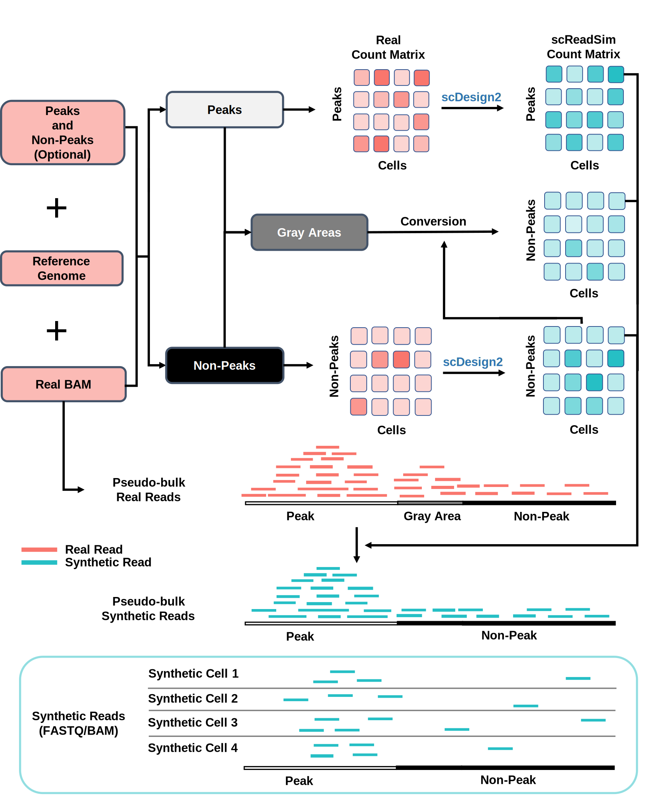
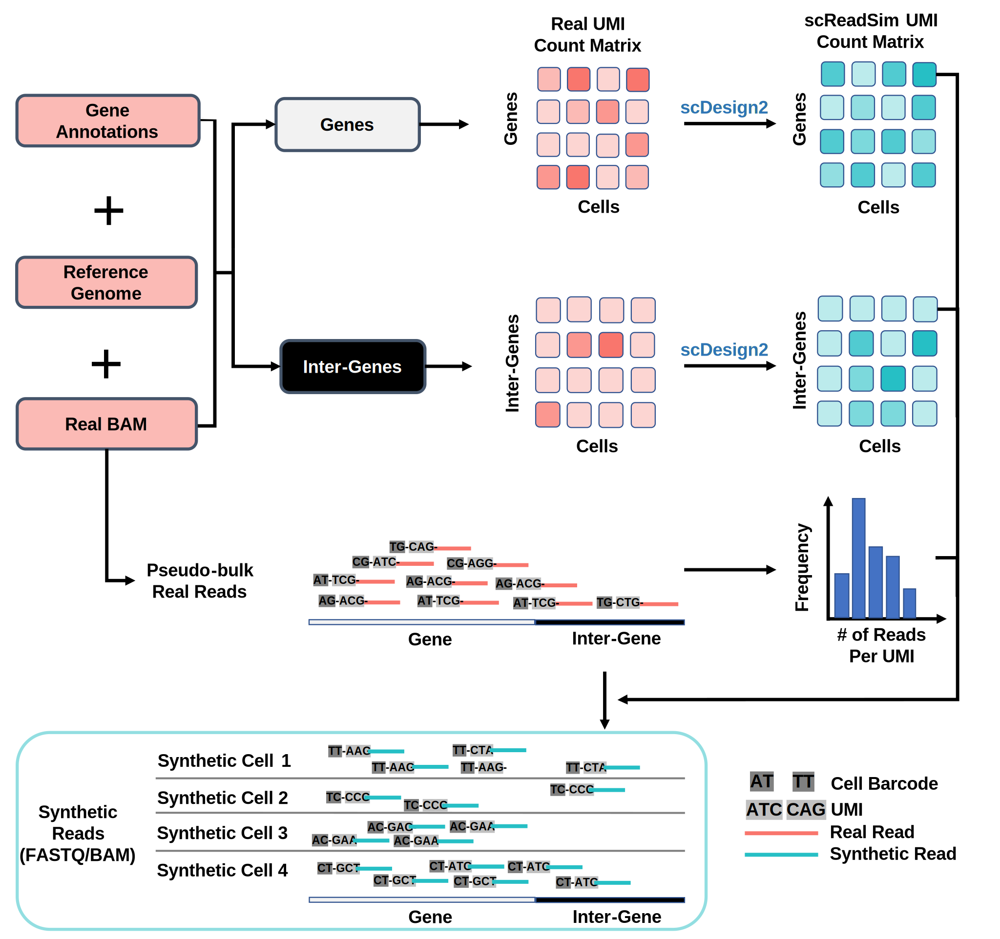

.. scReadSim documentation master file, created by
   sphinx-quickstart on Thu Mar 31 04:57:31 2022.
   You can adapt this file completely to your liking, but it should at least
   contain the root `toctree` directive.

|MIT license| |Docs|

**scReadSim**:  a single-cell RNA-seq and ATAC-seq read simulator
=================================================================

scReadSim is a single-cell RNA-seq and ATAC-seq read simulator. It starts from the BAM file of the input sequencing data and generates the synthetic dataset using BAM or FASTQ formats. The synthetic data generated by scReadSim resembles the real data in both the count and read level.

Workflow of scReadSim for generating scATAC-seq reads
-----------------------------------------------------

Workflow of scReadSim for generating scRNA-seq reads
----------------------------------------------------

Installation
------------

Quick install from `PyPI <https://pypi.org/project/scReadSim/1.3.0/#description>`_::

   pip install scReadSim

Or install the latest version from `GitHub <https://github.com/JSB-UCLA/scReadSim>`_, 

run::

    git clone https://github.com/JSB-UCLA/scReadSim.git
    pip install scReadSim --user

or::

    pip install git+https://github.com/JSB-UCLA/scReadSim.git

.. toctree::
   :maxdepth: 1
   :caption: Overview

   API
   About scReadSim

.. toctree::
   :maxdepth: 1
   :caption: Tutorials

   scReadSim on 10x scATAC-seq<scATACseq_NoInput_10X>
   scReadSim on 10x scRNA-seq<scRNAseq_10X>
   scReadSim on 10x scATAC-seq with user-input chromatin regions<scATACseq_INPUT_10X>

.. |Docs| image:: https://readthedocs.org/projects/screadsim/badge/?version=latest
   :target: https://screadsim.readthedocs.io/en/latest/?badge=latest
   :alt: Documentation Status

.. |MIT license| image:: https://img.shields.io/badge/License-MIT-blue.svg
   :target: https://lbesson.mit-license.org/